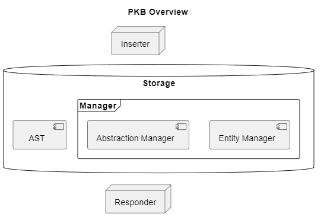

## PKB

Our PKB will consist of 3 sub-components:
Inserter: Includes API for receiving data from SP, storing it in Storage class
Storage: Manages our storage for AST and other DS
Responder: Includes API for accepting query from, and returning a query result to QPS

With sub-components (1) and (3) providing the API to interact with other components SP and QPS, the PKB follows the Facade design pattern for structure, to protect the internals of its storage management.

For the storage sub-component, our PKB will include 2 main things: the AST (or a pointer to it), as well as augmenting data structures for design entities and abstractions.

### Other DS

The purpose of storing these additional DS for entities and abstractions is to speed up the response to queries received from the QPS. While this information can be extracted from the SP within the PKB, this design extraction is handled by the SP (as a form of pre-processing) and passed to the PKB purely for storage.

The data will be managed by managers inheriting from a Manager template class. The Factory method will be used as the creational design pattern. Entity Manager and Abstraction Manager will be implemented as subclasses. This design choice adheres to the Open-Closed principle, allowing us to extend our PKB storage to incorporate different design components, whilst remaining closed to modification.

The Entity Manager will store list of (entities, line number). The Abstraction Manager will store a list of (line number: line number) each for Follows/Parent, and a list of (variable: line number) each for Uses/Modifies.

### AST

We will be storing a pointer to the AST in our PKB to answer complex queries from the QPS which cannot be handled by our Entity and Abstraction Managers.

