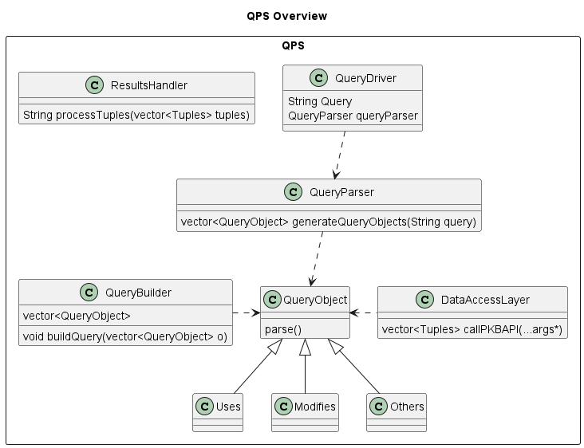
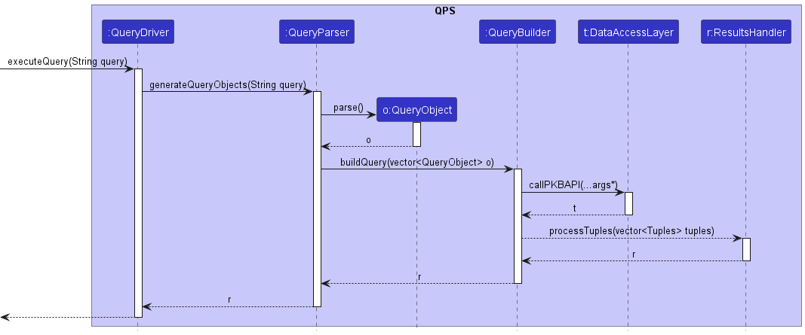

## **SE Principles**

1. Single Responsibility Principle
 
We used SRP in our design as each component is responsible for a single purpose only. 

2. Open Close Principle
 
Each Query Object is a class on its own. Hence, it is extensible as we can add more Query Object types, and the Query Object class is closed to modifications

3. Don’t Repeat Yourself
 
We abstracted all our code into methods, removing the need to repeat code

4. Keep it Simple Stupid
 
We abstracted each class to handle a single responsibility by keeping it simple

## **Design Patterns**

1. Facade Pattern
 
We used facade pattern between the PKB and the QPS which aligns with Single Responsibility Principle 

2. Chain of Responibility
 
We used the chain of responsiblity behavioural pattern. Each Class handles it's responsiblity and passes the output to the next Class, mirroring this design pattern.
